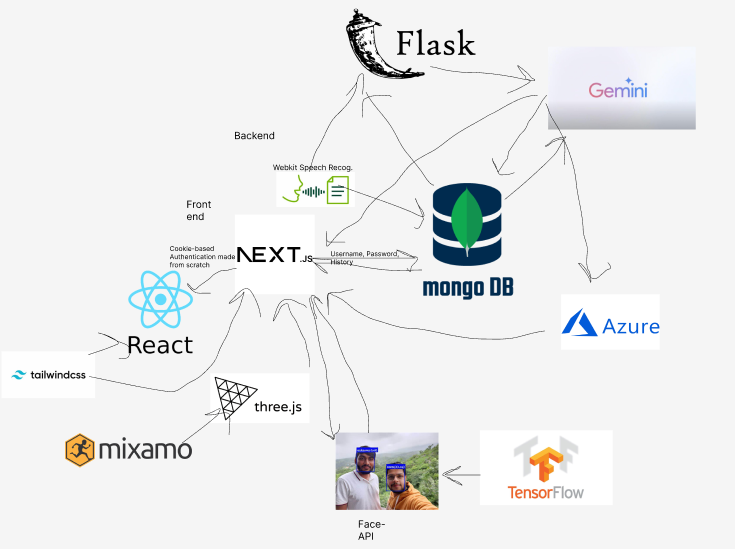

# Whats It About
When your friends die one by one—unsure of what's next. When your loved ones forget or abandon you. As we humans progress further into the future, we correspondingly neglect the past.  That's how  my project, Philos- the Greek for friend, started. I aimed to create a welcoming, helpful, kind robot to show what small hope can bring.
# Technologies are used?

# How to Run
1. Open two windows, one for the flask backend and other for the Next server.  
2. Install all the dependencies
3. You got this from here